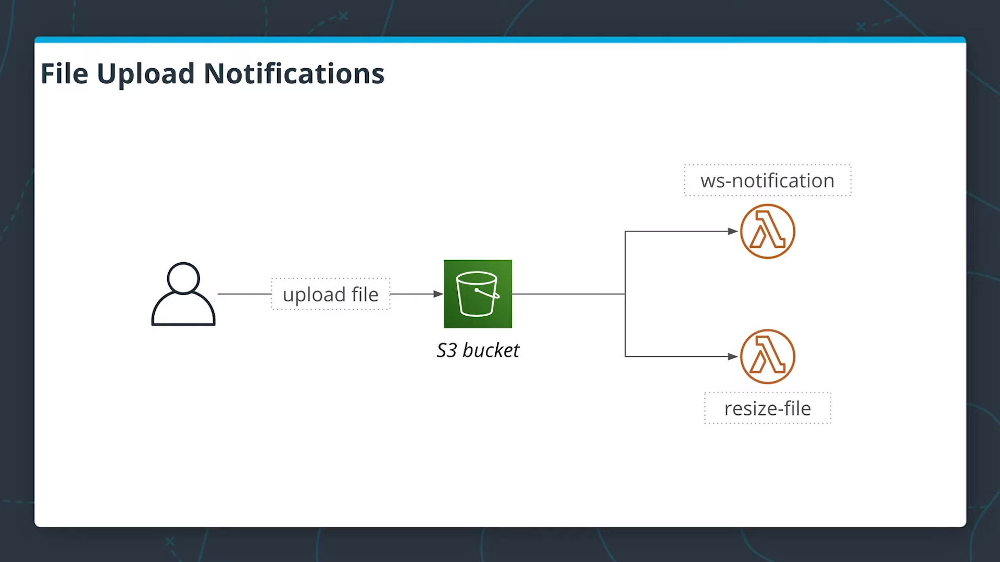

# Lesson 4 : Event processing

In this exercise, you will have to :

- implement a Lambda function that processes newly uploaded images, creates a smaller version of the same image, and uploads an image to a different S3 bucket.
- Enable full-text search with Elasticsearch.

Full instructions [here](lesson-4-exercise-instructions.pdf)

## Architecture




## Getting started

### Prerequisites

You need to install:

- [Serverless](https://github.com/serverless/serverless)
- [Wscat](https://github.com/websockets/wscat)

### Deployment

```bash
cd solution-kendyjm
npm install
serverless deploy -v
```

## Test

Use `serverless info` to retrieve all the available endpoints

### Connect to Websocket endpoint

`wscat -c wss://{{apiId}}.execute-api.{{region}}.amazonaws.com/dev`

To receive notification on image upload!

### Setup kibana

Connect to Kibana by using the URL mentionned in <https://console.aws.amazon.com/es>
Create an index pattern in 'Management\index patterns'

### Upload image using React application

```bash
cd client
npm install
npm run start
```

### Upload image using Postman

Create a group and upload an image

`POST https://{{apiId}}.execute-api.{{region}}.amazonaws.com/dev/groups/{{groupId}}/images`

### Search image using Kibana

In Discover, search for an image name that you've uploaded.
