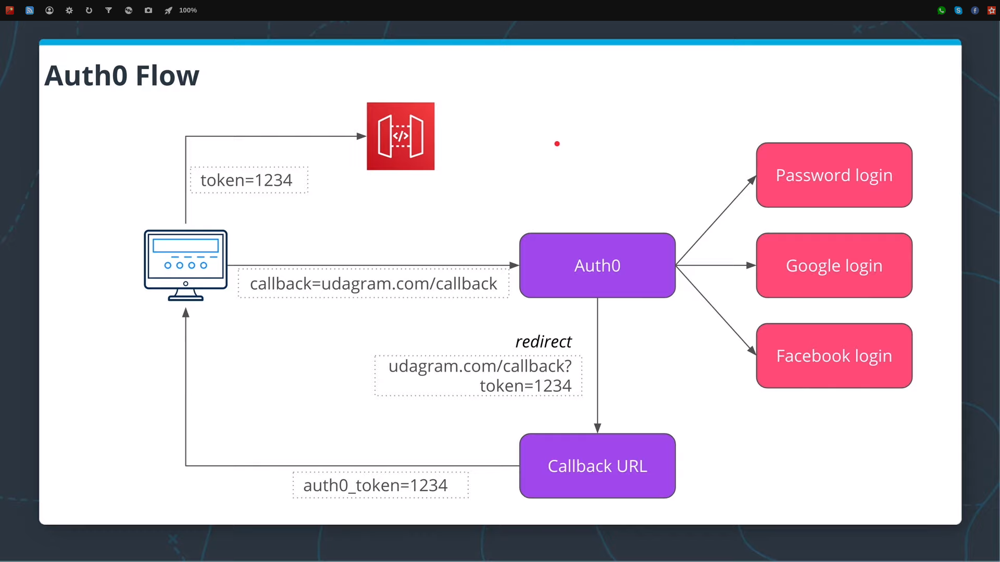
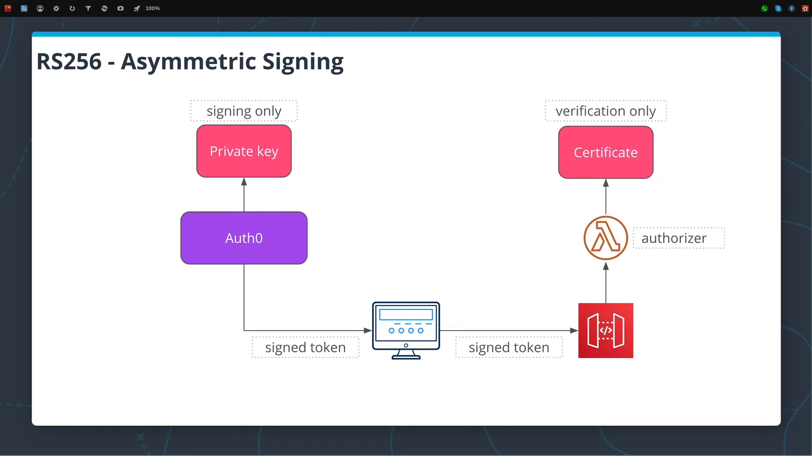

# Lesson 5 : Authentication

In this exercise, you will have to implement three new features in the image sharing application:

- A custom authorizer that verifies JWT tokens signed using RS256 (asymmetric) algorithm
- A function that extracts a user id from a JWT token
- Update the CreateGroup function and store ID of a user with each new group object stored in DynamoDB

Full instructions :

- [lesson-5-exercise-instructions.pdf](lesson-5-exercise-instructions.pdf)
- [https://www.youtube.com/watch?v=X3dOWexor3g](https://www.youtube.com/watch?v=X3dOWexor3g)

## Architecture




## Getting started

### Prerequisites

You need to install:

- [Serverless](https://github.com/serverless/serverless)

### Deployment

You need to ensure that S3 buckets have unique names.
To ensure that your S3 buckets have unique names add a random string to the end of S3 bucket names in the serverless.yml file. Let's say you want to add a random string ab4fe. You would need to change the following section like this:

```yaml
environment:
    IMAGES_S3_BUCKET: serverless-udagram-images-ab4fe-${self:provider.stage}
    THUMBNAILS_S3_BUCKET: serverless-udagram-thumbnail-ab4fe-${self:provider.stage}
```

```bash
cd solution-kendyjm
npm install
serverless deploy -v
```

## Test using React application

```bash
cd client
npm install
npm run start
```

Login with Google, you should be now authentified.

Create a group.
Once a group is created, you should be able to see it in the Groups-dev DynamoDB table, but now it should contain an attribute containing a user's id.

